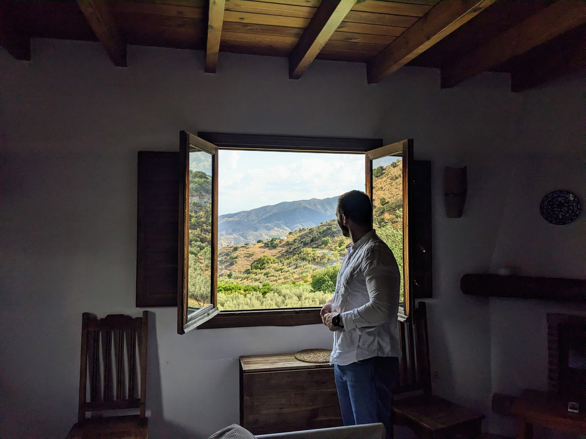

# fullypeek

[](https://github.com/clintval/fullypeek/actions/workflows/rust.yml)
[](https://coveralls.io/github/clintval/fullypeek?branch=main)
[](https://www.rust-lang.org/)

Peek forward in an iterator as far as you'd like, memory allowing!

```console
cargo add fullypeek
```



```rust
let mut peekable = vec![1, 2, 3].into_iter().fully_peekable();

assert_eq!(peekable.peek(), Some(&1));
assert_eq!(peekable.peek_many(2), vec!(Some(&1), Some(&2)));

peekable.next();

assert_eq!(peekable.peek(), Some(&2));
assert_eq!(peekable.peek_many(2), vec!(Some(&2), Some(&3)));

peekable.next();

assert_eq!(peekable.peek(), Some(&3));
assert_eq!(peekable.peek_many(2), vec!(Some(&3), None));
```
